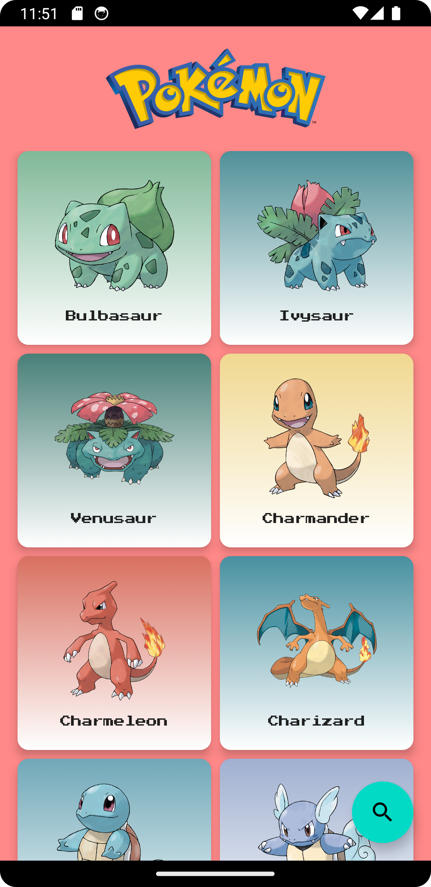

# Pokédex usando Jetpack Compose

Bem-vindo ao repositório da Pokédex desenvolvida com Jetpack Compose! Este é um aplicativo de exemplo que demonstra o uso do Jetpack Compose para criar uma interface de usuário moderna e interativa para exibir informações sobre diferentes Pokémon.



## Visão Geral

A Pokédex usando Jetpack Compose é um aplicativo de amostra que utiliza as mais recentes tecnologias do Jetpack Compose para criar uma interface de usuário responsiva e atraente. O aplicativo se conecta a uma API de Pokémon para obter dados detalhados sobre diferentes Pokémon e exibe essas informações de maneira agradável aos usuários.

Principais recursos do aplicativo:

- Listagem de Pokémon: Veja uma lista de Pokémon com imagens e nomes.
- Detalhes do Pokémon: Visualize informações detalhadas sobre um Pokémon específico.
- Navegação fluída: Use gestos de deslizamento para navegar entre a lista e os detalhes.
- UI responsiva: A interface do usuário se ajusta automaticamente a diferentes tamanhos de tela.

## Pré-requisitos

Antes de começar, certifique-se de ter as seguintes ferramentas instaladas em seu ambiente de desenvolvimento:

- Android Studio 4.2 ou superior.
- Kotlin 1.5 ou superior.

## Como Executar o Aplicativo

1. Clone este repositório para o seu ambiente local usando o seguinte comando:

```bash
git clone https://github.com/Selbstverlust/jetpack_compose_pokedex.git
```

2. Abra o Android Studio e selecione "Open an existing Android Studio project".

3. Navegue até o diretório onde você clonou o repositório e selecione a pasta do projeto.

4. Aguarde até que o Android Studio sincronize o projeto e configure as dependências.

5. Selecione um emulador Android ou um dispositivo físico para executar o aplicativo.

6. Pressione o botão "Run" (Executar) no Android Studio e o aplicativo será compilado e executado no dispositivo selecionado.
